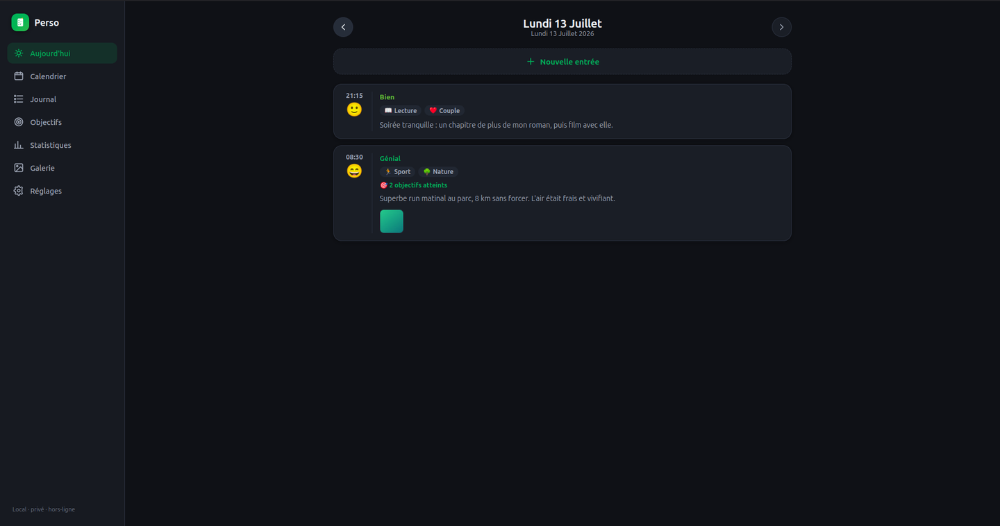
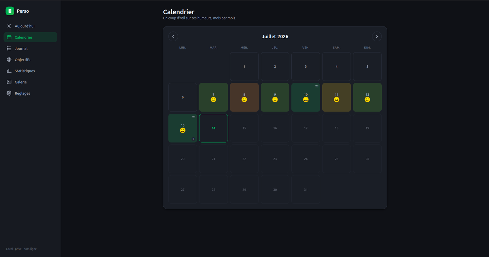
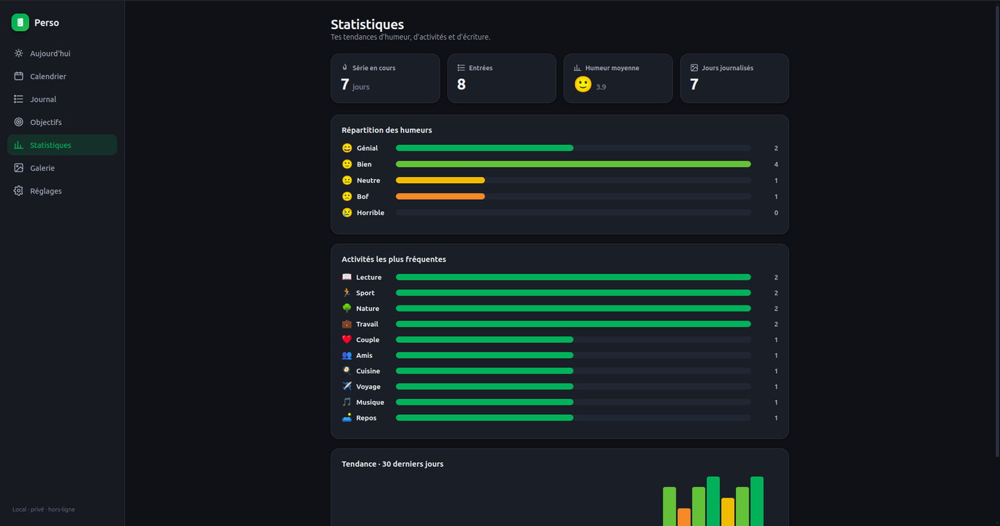
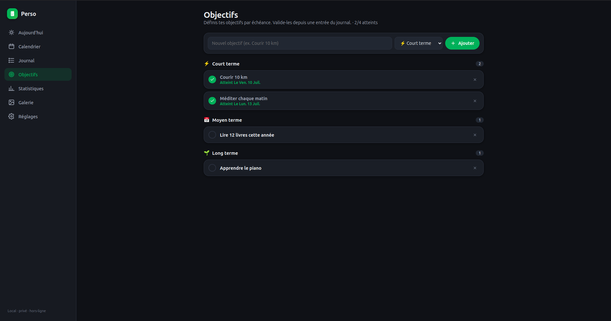
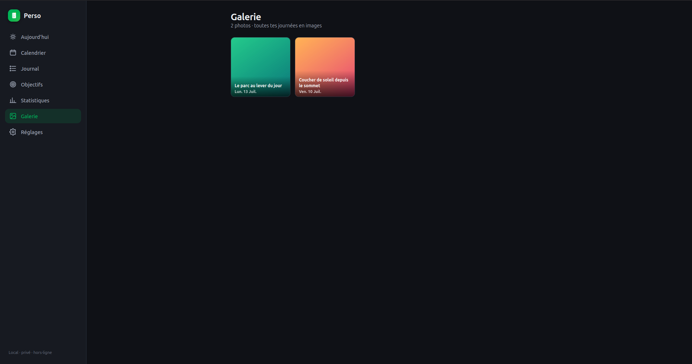

<h1 align="center">📔 Mon Journal</h1>

<p align="center">
  Journal intime <b>local, privé et hors-ligne</b> — humeurs, activités, objectifs et photos.<br>
  Application de bureau chiffrée, inspirée de <a href="https://github.com/demizo/daily_you">Daily You</a>.
</p>

<p align="center">
  <a href="https://github.com/M-1u/mon-journal/releases/latest"></a>
  <a href="https://github.com/M-1u/mon-journal/releases"></a>
  
  <a href="LICENSE"></a>
  
</p>

<p align="center">
  <b>🇫🇷 Français</b> · <a href="README.en.md">🇬🇧 English</a>
  &nbsp;•&nbsp;
  <a href="https://github.com/M-1u/mon-journal/releases/latest"><b>⬇️ Télécharger</b></a>
</p>

## Captures d'écran

| La journée | Le calendrier des humeurs |
| :---: | :---: |
|  |  |
| **Les statistiques** | **Les objectifs** |
|  |  |

<p align="center"></p>

## Fonctionnalités

- **Plusieurs journaux** — crée autant de journaux séparés que tu veux (ex.
  Personnel, Travail). Chacun a ses propres entrées, photos et réglages.
- **Mot de passe + chiffrement** — chaque journal est protégé par un mot de passe
  **obligatoire** (défini à la création, demandé à chaque ouverture). Les entrées
  et les photos sont **chiffrées sur le disque** (AES-256-GCM ; clé dérivée du mot
  de passe par scrypt). Tu peux **changer le mot de passe** dans les Réglages.
  ⚠️ Comme c'est du vrai chiffrement, un mot de passe **oublié = données perdues**
  (aucune récupération possible).
- **Objectifs** — définis des objectifs à **court / moyen / long terme** (liste
  globale dans l'onglet Objectifs). Depuis chaque entrée, tu les **valides** via
  une liste déroulante ; ils s'affichent alors comme « atteints » avec la date.
- **Humeur du jour** — 5 niveaux (Génial → Horrible), comme Daily You / Daylio.
- **Photos par jour** — ajoute des images à chaque journée, copiées dans ton
  dossier, avec une **description** (légende) sous chaque photo, reprise dans la galerie.
- **Éditeur visuel (WYSIWYG)** — cliquer sur Gras met le texte en gras
  directement, comme dans un traitement de texte : gras, italique, titre, listes
  (à puces / numérotées), citation, lien, code. Raccourcis Ctrl+B / Ctrl+I /
  Ctrl+K. Le contenu reste **stocké en Markdown** dans tes fichiers.
- **Calendrier** — chaque jour coloré selon ton humeur, d'un coup d'œil.
- **Journal (timeline)** — toutes tes entrées, de la plus récente à la plus ancienne.
- **Statistiques** — série en cours (streak), humeur moyenne, répartition, tendance sur 30 jours.
- **Galerie** — toutes tes photos réunies, avec vue plein écran.
- **Thèmes** — clair / sombre / système, + couleur d'accent au choix.
- **Rappel quotidien** — notification à l'heure de ton choix.
- **Sauvegarde / restauration** — exporte une copie lisible (JSON, déchiffrée) de
  ton journal depuis les Réglages, et réimporte-la (fusion). Indispensable pour ne
  jamais rester coincé.
- **Français / English** — sélecteur de langue dans les Réglages ; toute l'interface
  bascule instantanément.
- **Tes données t'appartiennent** — de simples fichiers dans un dossier que tu contrôles,
  aucun compte, aucune pub, aucun suivi.

## Où sont mes données ?

Chaque journal est un sous-dossier dans `~/Documents/MonJournal/` :

```
MonJournal/
  personnel/                  (un dossier par journal)
    settings.json             préférences (thème, accent, rappel)
    entries/YYYY-MM-DD.json    une entrée par jour (humeur, texte, photos)
    images/                    les photos importées
  travail/
    ...
```

Les fichiers `entries/*.json` et les images sont **chiffrés** (AES-256-GCM). La
liste des journaux et, pour chacun, le **sel** + la **clé de données chiffrée par
le mot de passe** (jamais le mot de passe en clair) sont dans `journals.json`
(dossier de config de l'app). Ouvrir un journal = dériver la clé du mot de passe
(scrypt) et déchiffrer la clé de données. Changer le mot de passe ne fait que
**ré-emballer** cette clé — les fichiers ne sont pas retouchés.

**Chiffrement réel = mot de passe oublié irrécupérable.** Le `settings.json`
(thème/accent) reste en clair (aucune donnée personnelle).

La logique de chiffrement/stockage est isolée dans `electron/journal-core.cjs` et
testée : `npm test` (`electron/journal-core.test.cjs`) vérifie les allers-retours
chiffrement, le rejet des mauvais mots de passe et le changement de mot de passe.

## Lancer l'application

Une entrée **« Mon Journal »** a été ajoutée à ton menu d'applications (icône livre verte).

En ligne de commande :

```bash
cd ~/Code/mon-journal
npm run build   # (une fois, ou après une modif du code)
./run.sh        # lance l'app
```

### Construire un exécutable (AppImage Linux)

```bash
npm run dist    # génère dist/Mon Journal-<version>.AppImage
```

L'icône vient de `build/icon.png`. Le fichier produit est autonome et lançable
(`chmod +x` puis double-clic, ou `./Mon\ Journal-*.AppImage`).

### Développement

```bash
npm run dev     # serveur Vite + Electron avec rechargement à chaud
npm test        # tests headless du cœur logique (chiffrement, export/import…)
```

Le mode `dev` utilise une config **isolée** (`.dev-data/` dans le projet) grâce à
la variable `MONJOURNAL_CONFIG_DIR`, pour ne jamais toucher tes vrais journaux
(`~/Documents/MonJournal/`). Pour lancer une session de test jetable :

```bash
MONJOURNAL_CONFIG_DIR=/tmp/mon-journal-test ./run.sh
```

Quand `MONJOURNAL_CONFIG_DIR` est défini, le registre des journaux **et** leurs
dossiers de données vivent là-dedans, et ce choix n'est
jamais enregistré : tes vraies données restent intactes.

## Stack

- **Electron** — fenêtre de bureau native
- **React + Vite** — interface
- **TipTap** — éditeur visuel ; **marked** + **turndown** — pont Markdown ⇆ HTML
- Stockage : fichiers JSON par journal + protocole `journalimg://` pour les images
- Mots de passe : hash **scrypt** salé (jamais de mot de passe en clair)
- Aucune base de données, aucun module natif : robuste et transparent.

## Télécharger

Récupère la dernière version sur la page [**Releases**](https://github.com/M-1u/mon-journal/releases/latest)
(installateur **Windows** `.exe` et **AppImage** Linux).

## Licence

[MIT](LICENSE)
